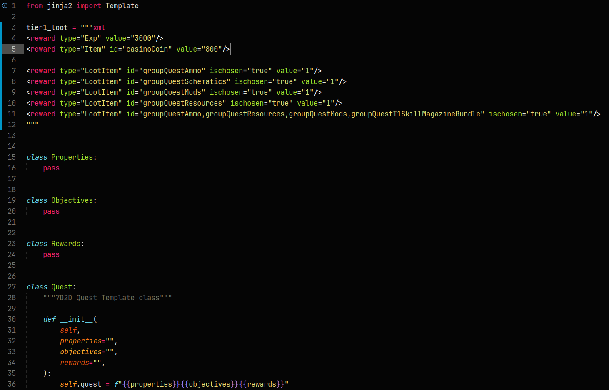

# XMLPython

This is a syntax definition for sublime text for Python that has special parts with embedded XML syntax.
The syntax is the same as the [Default Python Syntax](https://github.com/sublimehq/Packages/tree/master/Python), the only difference is it embeds XML syntax in docstrings declared like:
```
string = """xml
	everything inside the docstring will have xml script syntax
"""[3:]
```
Adding the letters "xml" immediately after the 3 quotes that initalize a docstring enables xml syntax. In the embedded parts all plugin features like autocomplete, goto, and popups will still work.

F-strings and Jinja2 templates can also be used like this:
```
string = f"""xml
	add_treasury = 999
"""[3:]
```
```
variable = "hello"
string = Template('''xml
	
	variable = {{variable}}
	Jinja2 Templates are more flexible
''').render(variable=variable)
```


